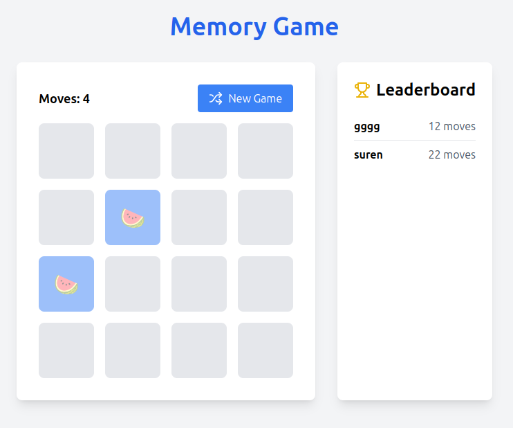

# Memory Game

This is a simple Memory Game built using React and styled with TailwindCSS. The game challenges players to find matching pairs of cards from a grid by clicking to reveal them, testing memory skills.

**DEMO**: Check out the live demo of the Memory Game [here](https://memory-game-051024.netlify.app/).



## Features

- **Responsive design** using TailwindCSS.
- **Interactive gameplay**: Click to reveal cards and find pairs.
- **Leaderboards**: Tracks player scores (stored locally).
- **Animations** for card flips and matching pairs.

## Technologies Used

- **React**: JavaScript library for building the UI.
- **TailwindCSS**: Utility-first CSS framework for responsive design.
- TODO: **SQLite**: For local leaderboard storage.
- TODO: **Express**: Backend for serving the game.

## Getting Started

### Prerequisites

- Node.js
- npm or yarn

### Installation

1. Clone the repository:

```bash
Copy code
git clone https://github.com/surendias/memory-game.git
cd memory-game
```

2. Install dependencies:

```bash
Copy code
npm install
```

3. Start the development server:

```bash
Copy code
npm start
```

4. The app will be available at http://localhost:3000.

### Available Scripts

- **`npm start`**: Starts the development server.
- **`npm run build`**: Builds the app for production.
- **`npm test`**: Runs tests (if any).

## How to Play

1. Click on a card to reveal its hidden symbol.
2. Click on another card to find its matching pair.
3. Continue flipping cards to find all matching pairs.
4. The goal is to match all pairs in the fewest number of moves.

## Contributing

Feel free to submit issues or pull requests.

## License

MIT

---

This README provides an overview of your project, its setup, and gameplay instructions.
